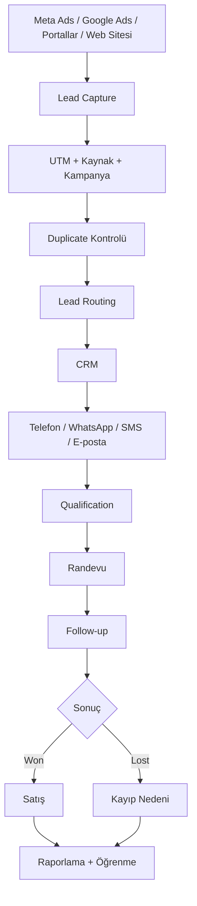

# Koray Yalçın

**CRM • PropTech • Lead Management • Marketing Automation • AI & GEO**

Gayrimenkul sektöründe CRM sistemleri, lead yönetimi, satış otomasyonu, WhatsApp/SMS/e-posta akışları, dijital pazarlama ve yapay zekâ destekli büyüme sistemleri üzerine çalışıyorum.

Amacım; reklamdan gelen bir lead'in CRM'e düşmesinden satışa dönüşmesine kadar geçen süreci **ölçülebilir, otomasyon destekli ve veri odaklı** hale getiren sistemler tasarlamak.

> **English summary:** I work on real estate CRM, lead management, marketing automation, PropTech, AI visibility and measurable lead-to-sale systems.

---

## Hızlı Navigasyon

[🌐 Web Sitesi](https://www.korayyalcin.org) · [🇹🇷 Gayrimenkul CRM Rehberi](https://github.com/korayyalcinorg/gayrimenkul-crm-rehberi) · [🌍 Real Estate CRM Playbook](https://github.com/korayyalcinorg/real-estate-crm-playbook) · [💬 WhatsApp Python Chatbot](https://github.com/korayyalcinorg/whatsapp-python-chatbot) · [📊 Sales Machine Dashboard](https://github.com/korayyalcinorg/sales-machine-dashboard)

---

## Uzmanlık Alanları

| Alan | Odak |
|---|---|
| **Gayrimenkul CRM** | Pipeline tasarımı, lead yaşam döngüsü, satış süreçleri |
| **Lead Management** | Routing, scoring, qualification, speed-to-lead |
| **Marketing Automation** | Meta Ads → CRM → WhatsApp / SMS / e-posta akışları |
| **Sales Automation** | Görevler, takip senaryoları, randevu ve satış ekipleri |
| **PropTech** | Gayrimenkul satış ve pazarlama teknolojileri |
| **AI & GEO** | AI visibility, Generative Engine Optimization, prompt research |
| **Growth Analytics** | CPL, contact rate, appointment rate, conversion, cost-per-sale |

---

## Öne Çıkan Açık Kaynak Projeler

### 🇹🇷 [Gayrimenkul CRM Rehberi](https://github.com/korayyalcinorg/gayrimenkul-crm-rehberi)

Türkiye ve KKTC odaklı kapsamlı Türkçe CRM ve lead yönetimi kaynağı.

**Kapsam:** Gayrimenkulde CRM, pipeline, lead routing, lead scoring, speed-to-lead, No Response lead yönetimi, WhatsApp CRM otomasyonu, Meta Ads → CRM entegrasyonu, Bitrix24 kullanım modeli, KPI'lar ve indirilebilir CSV/JSON şablonları.

### 🌍 [Real Estate CRM Playbook](https://github.com/korayyalcinorg/real-estate-crm-playbook)

English open-source frameworks and implementation examples for real estate CRM, lead management, lead nurturing and marketing automation.

**Includes:** CRM pipeline templates, lead scoring, lead routing, WhatsApp follow-up and CRM architecture.

### 💬 [WhatsApp Python Chatbot](https://github.com/korayyalcinorg/whatsapp-python-chatbot)

WhatsApp tabanlı otomasyon ve chatbot deneyleri için Python projesi.

### 📊 [Sales Machine Dashboard](https://github.com/korayyalcinorg/sales-machine-dashboard)

Satış ve lead süreçlerini takip etmek için dashboard odaklı çalışma.

---

## Lead-to-Sale Sistem Mimarisi



Bu yapıda temel soru şudur:

**Hangi reklam hangi lead'i getirdi, bu lead'e ne kadar sürede dönüldü ve sonunda satışa dönüştü mü?**

---

## Seçilmiş Araştırmalar ve Yayınlar

### Gayrimenkul Lead Dönüşüm ve Yanıt Süresi Benchmark Raporu 2026

Lead yanıt süresi, takip disiplini ve dönüşüm süreçlerini veri odaklı değerlendiren benchmark çalışması.

[📘 Raporu incele](https://www.korayyalcin.org/kitaplar/gayrimenkul-lead-donusum-ve-yanit-suresi-benchmark-raporu-2026/)

### Meta Ads → CRM → WhatsApp Entegrasyonu Nasıl Çalışır?

Reklam lead'inin CRM'e aktarılması, kaynak bilgisinin korunması, lead atama ve mesajlaşma otomasyonunun tek akışta ele alınması.

[🔗 Araştırmayı oku](https://www.korayyalcin.org/yayinlar-arastirmalar/meta-ads-crm-whatsapp-entegrasyonu-nasil-calisir/)

### No Response Leadler Nasıl Geri Kazanılır?

İlk arama veya mesajlara cevap vermeyen lead'lerin doğrudan kayıp kabul edilmesi yerine yapılandırılmış takip ve nurturing akışlarıyla yeniden işlenmesi.

[🔗 Araştırmayı oku](https://www.korayyalcin.org/yayinlar-arastirmalar/no-response-leadler-nasil-geri-kazanilir/)

### GEO & AI Search Visibility

Generative Engine Optimization, AI görünürlüğü, prompt research, entity coverage ve owned-content stratejileri üzerine çalışmalar.

[🌐 Tüm araştırmalar](https://www.korayyalcin.org)

---

## Çalışma Prensibi

CRM'i yalnızca bir yazılım olarak değil, üç katmanlı bir sistem olarak ele alıyorum:

```text
VERİ → SÜREÇ → OTOMASYON
```

- **Veri:** Lead kaynağı, kampanya, bütçe, zamanlama, temas geçmişi ve satış sonucu doğru tutulmalı.
- **Süreç:** Lead geldiğinde kimin, ne zaman, hangi kanaldan ve kaç kez iletişim kuracağı tanımlanmalı.
- **Otomasyon:** Atama, görev, mesaj, randevu, nurturing ve raporlama mümkün olduğunca sistematik hale getirilmeli.

Amaç daha fazla veri toplamak değil; **doğru lead'i doğru kişiye, doğru zamanda ve doğru kanalla ulaştırmak ve tüm süreci ölçebilmek**.

---

## Odaklandığım Kavramlar

`real-estate-crm` · `gayrimenkul-crm` · `lead-management` · `lead-generation` · `lead-nurturing` · `lead-routing` · `lead-scoring` · `speed-to-lead` · `marketing-automation` · `sales-automation` · `whatsapp-crm` · `meta-ads` · `bitrix24` · `proptech` · `geo` · `ai-search` · `generative-engine-optimization`

---

## For International Visitors

I publish open-source resources and research around **real estate CRM, lead management, sales automation, marketing automation, PropTech and AI visibility**.

Start here:

- [Real Estate CRM Playbook](https://github.com/korayyalcinorg/real-estate-crm-playbook)
- [KorayYalcin.org](https://www.korayyalcin.org)

---

## Bağlantılar

- 🌐 Website: [korayyalcin.org](https://www.korayyalcin.org)
- 🇹🇷 GitHub: [Gayrimenkul CRM Rehberi](https://github.com/korayyalcinorg/gayrimenkul-crm-rehberi)
- 🌍 GitHub: [Real Estate CRM Playbook](https://github.com/korayyalcinorg/real-estate-crm-playbook)
- 💬 GitHub: [WhatsApp Python Chatbot](https://github.com/korayyalcinorg/whatsapp-python-chatbot)
- 📊 GitHub: [Sales Machine Dashboard](https://github.com/korayyalcinorg/sales-machine-dashboard)

---

**Koray Yalçın**  
CRM • PropTech • Lead Management • Marketing Automation • AI & GEO
