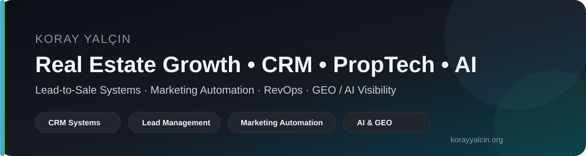
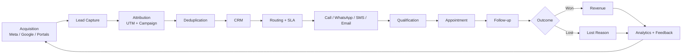

  

  
  
  
  

# Koray Yalçın

**Real Estate Growth Architect • CRM • PropTech • RevOps • Marketing Automation • AI & GEO**

Gayrimenkul sektöründe reklamdan satışa uzanan süreci tek bir ölçülebilir sistem olarak ele alıyorum. Lead üretimi, CRM, WhatsApp/SMS/e-posta otomasyonu, satış operasyonları, attribution, dashboard ve yapay zekâ destekli iş akışlarını birbirine bağlayan **lead-to-sale sistemleri** tasarlıyorum.

> Temel yaklaşım: **Veri → Süreç → Otomasyon → Ölçüm → Öğrenme**

---

## Rakamlarla çalışma alanı

| **500.000+** | **24.850+** | **18 proje** | **CRM + Automation** |
|:---:|:---:|:---:|:---:|
| Lead yönetimi deneyimi | Benchmark analizindeki lead | Benchmark kapsamındaki konut projesi | CRM, WhatsApp, SMS, e-posta ve satış akışları |

**Kaynaklar:** [KorayYalcin.org](https://www.korayyalcin.org) · [2026 Lead Benchmark](https://www.korayyalcin.org/yayinlar-arastirmalar/gayrimenkul-lead-donusum-ve-yanit-suresi-benchmark-2026/)

---

## Systems I Build

<table>
<tr>
<td width="50%" valign="top">

### 🎯 Lead Acquisition & Capture

**Meta Ads · Google Ads · Portallar · Landing Pages · UTM**

Lead'in hangi reklam, kampanya ve kanaldan geldiğini kaybetmeden CRM'e aktaracak veri katmanı.

</td>
<td width="50%" valign="top">

### ⚙️ CRM Follow-up Automation

**Routing · Scoring · SLA · Follow-up · Appointment**

Lead atama, ilk temas, tekrar arama, randevu, nurturing ve satış ekibi görevlerini sistematik hale getiren CRM akışı.

</td>
</tr>
<tr>
<td width="50%" valign="top">

### 🤖 AI Content Funnel

**Research · Blog · Social · Lead Magnet · AI Visibility**

Araştırma, içerik ve otorite varlıklarını tek bir owned-content sisteminde birleştiren yayın mimarisi.

</td>
<td width="50%" valign="top">

### 📊 Sales Dashboard Layer

**Ads · CRM · Appointment · Conversion · Revenue**

Reklam verisini CRM ve satış sonuçlarıyla birleştirerek lead-to-sale performansını görünür hale getiren raporlama katmanı.

</td>
</tr>
</table>

[→ Büyüme sistemleri ve entegrasyon altyapısı](https://www.korayyalcin.org/sistemler/)

---

## Saha verisiyle doğrulanan çalışmalar

<table>
<tr>
<td width="33%" valign="top">

### ⚡ Speed-to-Lead

KKTC gayrimenkul vaka analizinde ilk temas süresi **180 dakikadan 3 dakikanın altına** indirildi.

Randevu oranı **%8,2 → %21,4**, satış dönüşümü **%0,6 → %2,85**.

[Case study →](https://www.korayyalcin.org/yayinlar-arastirmalar/case-study-kktc-gayrimenkul-lead-nurturing-30-gun/)

</td>
<td width="33%" valign="top">

### 🧹 CRM Lead Leakage

5.800 lead'lik vaka çalışmasında CRM deduplication ve lead routing mimarisi incelendi.

Mükerrer lead oranı **%24 → %2,1** seviyesine indirildi.

[Case study →](https://www.korayyalcin.org/yayinlar-arastirmalar/case-study-insaat-firmasi-crm-deduplication-ve-lead-routing/)

</td>
<td width="33%" valign="top">

### 🎯 Programmatic Retargeting

2.150 yüksek niyetli alıcı adayı üzerinde CRM segmentli programatik retargeting yaklaşımı incelendi.

ROAS **3,2x → 16,8x** seviyesine yükseldi.

[Case study →](https://www.korayyalcin.org/yayinlar-arastirmalar/case-study-gayrimenkul-programmatic-retargeting-roas-optimizasyonu/)

</td>
</tr>
</table>

> Vaka çalışmaları belirli proje ve dönemlerin saha sonuçlarını gösterir; evrensel performans garantisi olarak yorumlanmamalıdır.

---

## Featured Research & Publications

| Çalışma | Tür | Odak |
|---|---|---|
| [**Gayrimenkul Lead Dönüşüm ve Yanıt Süresi Benchmark Raporu 2026**](https://www.korayyalcin.org/yayinlar-arastirmalar/gayrimenkul-lead-donusum-ve-yanit-suresi-benchmark-2026/) | Sektörel Benchmark | 24.850+ lead, 18 proje, Speed-to-Lead, CPL, randevu ve satış dönüşümü |
| [**KKTC WhatsApp Automation & Speed-to-Lead**](https://www.korayyalcin.org/yayinlar-arastirmalar/case-study-kktc-gayrimenkul-lead-nurturing-30-gun/) | Case Study | 3.420 uluslararası lead, CRM + WhatsApp + response time |
| [**CRM Deduplication & Lead Routing**](https://www.korayyalcin.org/yayinlar-arastirmalar/case-study-insaat-firmasi-crm-deduplication-ve-lead-routing/) | Case Study | 5.800 lead, veri hijyeni, lead leakage, round-robin routing |
| [**Programmatic Retargeting & ROAS Optimization**](https://www.korayyalcin.org/yayinlar-arastirmalar/case-study-gayrimenkul-programmatic-retargeting-roas-optimizasyonu/) | Case Study | First-party data, programmatic advertising, CRM segmentation |
| [**Yayınlar & Araştırmalar Knowledge Hub**](https://www.korayyalcin.org/yayinlar-arastirmalar/) | Knowledge Hub | AI, CRM, Lead Generation, PropTech, Gayrimenkul, AdTech |
| [**Kitaplar & Yayınlar**](https://www.korayyalcin.org/kitaplar/) | Publications | Kitap, e-kitap, benchmark ve araştırma yayınları |

---

## Research Library & Publications Index

GitHub profilindeki araştırmaları tek bir katalog altında topluyorum. Amaç, uzun form içeriklerin canonical kaynağını **KorayYalcin.org** üzerinde tutarken GitHub'da teknik, atıf verilebilir ve makine tarafından okunabilir bir yayın katmanı oluşturmaktır.

<table>
<tr>
<td width="50%" valign="top">

### 📚 [Research Library](research-library/README.md)

Kitaplar, akademik monografiler, benchmark raporları, saha vaka analizleri, CRM/automation rehberleri ve AI/GEO araştırmalarının insanlar için okunabilir kataloğu.

</td>
<td width="50%" valign="top">

### 🧠 [Publications JSON](data/publications-index.json)

Yayın başlığı, türü, yılı, dili, canonical URL'si ve konu etiketlerini içeren makine-okunabilir tam katalog.

</td>
</tr>
<tr>
<td width="50%" valign="top">

### 🔖 [BibTeX Citations](CITATION.bib)

Seçilmiş benchmark, vaka analizi ve araştırmalar için doğrudan kullanılabilir BibTeX atıf kayıtları.

</td>
<td width="50%" valign="top">

### 🌐 [Canonical Research Hub](https://www.korayyalcin.org/yayinlar-arastirmalar/)

Makalelerin, araştırma notlarının, vaka analizlerinin ve güncel yayınların ana kaynağı.

</td>
</tr>
</table>

**Katalog kapsamı:** Real Estate CRM · Lead Management · RevOps · Marketing Automation · PropTech · Programmatic & AdTech · AI Visibility · GEO

---

## GitHub Labs

<table>
<tr>
<td width="50%" valign="top">

### 🇹🇷 [Gayrimenkul CRM Rehberi](https://github.com/korayyalcinorg/gayrimenkul-crm-rehberi)

Türkçe CRM bilgi merkezi: pipeline, lead routing, scoring, speed-to-lead, No Response, WhatsApp otomasyonu, Meta Ads entegrasyonu, Bitrix24, KPI'lar ve indirilebilir şablonlar.

</td>
<td width="50%" valign="top">

### 🌍 [Real Estate CRM Playbook](https://github.com/korayyalcinorg/real-estate-crm-playbook)

English technical playbook for CRM architecture, lead routing, scoring, nurturing and marketing automation.

</td>
</tr>
<tr>
<td width="50%" valign="top">

### 📈 [Real Estate Lead Benchmarks](https://github.com/korayyalcinorg/real-estate-lead-benchmarks)

Benchmark methodology, metric definitions, synthetic datasets, data dictionary, JSON Schema and KPI calculation tools.

</td>
<td width="50%" valign="top">

### 💬 [WhatsApp Python Chatbot](https://github.com/korayyalcinorg/whatsapp-python-chatbot)

WhatsApp tabanlı otomasyon ve chatbot deneyleri için Python projesi.

</td>
</tr>
<tr>
<td width="50%" valign="top">

### 📊 [Sales Machine Dashboard](https://github.com/korayyalcinorg/sales-machine-dashboard)

Lead ve satış süreçlerini dashboard üzerinden takip etmeye yönelik uygulama çalışması.

</td>
<td width="50%" valign="top">

### 🧠 [Machine-readable Profile](data/koray-yalcin-profile.json)

Koray Yalçın'ın uzmanlık alanları, ana web varlığı ve seçilmiş teknik kaynaklarını Schema.org tabanlı JSON yapısında sunan entity dosyası.

</td>
</tr>
<tr>
<td width="50%" valign="top">

### 🎓 [Researcher Identity Starter](projects/researcher-identity-starter/README.md)

Araştırmacılar, bağımsız akademisyenler ve yazarlar için tek dosyalık public identity landing page; ORCID, ISNI, Wikidata, Scholar, yayınlar ve Schema.org Person yapısını bir araya getirir.

</td>
<td width="50%" valign="top">

### 🧩 [Schema.org Person JSON-LD Example](technical-examples/schema-person-jsonld/README.md)

`sameAs`, `identifier`, W3C/ORCID/ISNI ayrımı ve bağımlılıksız doğrulama scripti içeren küçük teknik örnek.

</td>
</tr>
</table>

---

## Lead-to-Sale Architecture

**Temel soru:** Hangi reklam hangi lead'i getirdi, lead'e ne kadar sürede dönüldü, hangi temsilci takip etti ve süreç satışa dönüştü mü?

---

## Technology & Integration Stack

  
  
  
  
  
  
  
  
  
  
  
  
  

Bu teknoloji listesi tek başına bir "tool stack" değil; reklam → veri → CRM → iletişim → satış → raporlama zincirindeki entegrasyon katmanlarını temsil eder.

[→ Sistem altyapısını incele](https://www.korayyalcin.org/sistemler/)

---

## Latest from KorayYalcin.org

Bu bölüm GitHub Actions tarafından korayyalcin.org yayın akışından otomatik olarak güncellenir.

<!-- LATEST:START -->

- [Vaka Analizi: Lüks Gayrimenkul Projesinde Programatik Retargeting ve ROAS Optimizasyonu](https://www.korayyalcin.org/yayinlar-arastirmalar/case-study-gayrimenkul-programmatic-retargeting-roas-optimizasyonu/)
- [Vaka Analizi: İnşaat Projesinde CRM Lead Sızıntılarını Önleme ve Temsilci Performans Analizi](https://www.korayyalcin.org/yayinlar-arastirmalar/case-study-insaat-firmasi-crm-deduplication-ve-lead-routing/)
- [Vaka Analizi: KKTC Gayrimenkul Projesinde WhatsApp Otomasyonu ve Speed to Lead İyileştirmesi](https://www.korayyalcin.org/yayinlar-arastirmalar/case-study-kktc-gayrimenkul-lead-nurturing-30-gun/)
- [Gayrimenkul Müşteri Adayı (Lead) Dönüşüm ve Yanıt Süresi Benchmark Raporu 2026](https://www.korayyalcin.org/yayinlar-arastirmalar/gayrimenkul-lead-donusum-ve-yanit-suresi-benchmark-2026/)
- [Trendyol Reklam Sistemi Nasıl Çalışıyor?](https://www.korayyalcin.org/yayinlar-arastirmalar/trendyol-reklam-sistemi/)

<!-- LATEST:END -->

[→ Tüm yayınları görüntüle](https://www.korayyalcin.org/yayinlar-arastirmalar/)

---

## Research Data & Entity Layer

GitHub profilini yalnızca görsel bir portföy olarak değil, makine tarafından okunabilir bir kaynak olarak da kullanıyorum.

- [`data/koray-yalcin-profile.json`](data/koray-yalcin-profile.json) — Schema.org tabanlı kişi/uzmanlık verisi
- [`technical-examples/schema-person-jsonld`](technical-examples/schema-person-jsonld/README.md) — Schema.org Person JSON-LD, `sameAs` / `identifier` ayrımı ve bağımlılıksız doğrulama örneği
- [`projects/researcher-identity-starter`](projects/researcher-identity-starter/README.md) — araştırmacılar ve akademik/profesyonel profiller için tek dosyalık identity/reference landing page starter'ı
- [`data/research-index.json`](data/research-index.json) — seçilmiş araştırmaların yapılandırılmış indeksi
- [`data/publications-index.json`](data/publications-index.json) — kitap, araştırma, vaka analizi ve teknik kaynakların tam yayın kataloğu
- [`data/publications.schema.json`](data/publications.schema.json) — yayın kataloğu için JSON Schema
- [`research-library/README.md`](research-library/README.md) — insan tarafından okunabilir araştırma kütüphanesi
- [`CITATION.bib`](CITATION.bib) — seçilmiş yayınların BibTeX atıf kayıtları
- [`real-estate-lead-benchmarks`](https://github.com/korayyalcinorg/real-estate-lead-benchmarks) — benchmark metodolojisi ve teknik veri katmanı
- [`gayrimenkul-crm-rehberi`](https://github.com/korayyalcinorg/gayrimenkul-crm-rehberi) — Türkçe CRM bilgi tabanı

---

## Odak Alanları

`real-estate-crm` · `lead-management` · `speed-to-lead` · `lead-routing` · `lead-scoring` · `lead-nurturing` · `marketing-automation` · `sales-automation` · `revops` · `whatsapp-crm` · `proptech` · `marketing-analytics` · `programmatic-advertising` · `geo` · `ai-search` · `generative-engine-optimization`

---

## For International Visitors

I publish research, frameworks and technical resources around **real estate CRM, lead management, RevOps, sales automation, PropTech and AI visibility**.

**Start here:** [English Profile](README.en.md) · [Research Library](research-library/README.md) · [Publications JSON](data/publications-index.json) · [Real Estate CRM Playbook](https://github.com/korayyalcinorg/real-estate-crm-playbook) · [Real Estate Lead Benchmarks](https://github.com/korayyalcinorg/real-estate-lead-benchmarks) · [KorayYalcin.org](https://www.korayyalcin.org)

---

  <strong>Koray Yalçın</strong> 
  CRM • PropTech • RevOps • Lead Management • Marketing Automation • AI & GEO  
  <a href="https://www.korayyalcin.org">Website</a> ·
  <a href="https://www.korayyalcin.org/yayinlar-arastirmalar/">Research</a> ·
  <a href="https://www.korayyalcin.org/sistemler/">Systems</a> ·
  <a href="https://www.korayyalcin.org/kitaplar/">Books & Publications</a>

